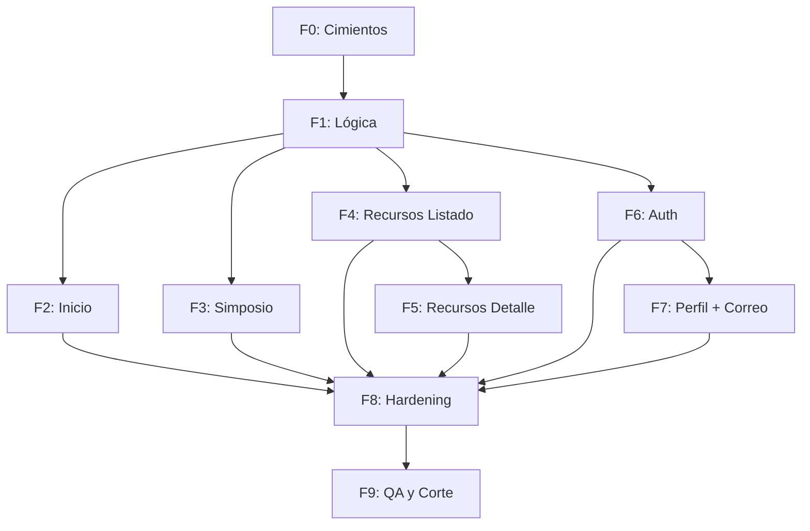

# Plan Maestro: Línea Web Público

**Línea:** `web-publico`
**Objetivo:** Construir el sitio web público de NOMON con 6 pantallas y lógica de autenticación/correo.
**Stack:** Next.js 15 (App Router) + TypeScript + Drizzle + Neon + better-auth + Cloudflare R2 + Biome + Vitest.

---

## Fases y Entregables

| Fase | Objetivo | Entregables | Riesgo | ¿Frena al humano? |
|------|----------|-------------|--------|-------------------|
| **F0** | Cimientos (Schema) | `REGISTRO_DE_ENTIDADES.md`, `logica_de_negocio.md`, `glosario.md` | Alto | Sí |
| **F1** | Lógica de Negocio | Flujos de auth, acceso a recursos, correo | Alto | Sí |
| **F2** | Inicio | Diseño + implementación de `/` | Medio | No |
| **F3** | Simposio | Diseño + implementación de `/simposio` | Medio | No |
| **F4** | Recursos (Listado) | Diseño + implementación de `/recursos` | Medio | No |
| **F5** | Recursos (Detalle) | Diseño + implementación de `/recursos/:slug` | Medio | No |
| **F6** | Auth | Diseño + implementación de modal de login/registro | Alto | Sí |
| **F7** | Perfil + Correo | Diseño + implementación de `/perfil` y `/correo` | Alto | Sí |
| **F8** | Hardening | Migración de datos, validación de schema, pruebas de integración | Alto | Sí |
| **F9** | QA y Corte | Verificación de gates, checklist de corte, merge `dev` → `main` | Máximo | Siempre |

---

## Detalle por Fase

### F0: Cimientos (Schema)

**Objetivo:** Definir el schema canónico del proyecto.

**Entregables:**
1. `arnes/nucleo/REGISTRO_DE_ENTIDADES.md` — Schema de Usuario, Recurso, Mensaje, Slide.
2. `arnes/nucleo/logica_de_negocio.md` — Flujos de auth, acceso a recursos, correo.
3. `arnes/nucleo/glosario.md` — Vocabulario de UI.

**Criterios de aceptación:**
1. El schema cubre todas las entidades de `docs/design/`.
2. No hay contradicciones internas en `REGISTRO_DE_ENTIDADES.md`.
3. `logica_de_negocio.md` documenta todos los flujos críticos (auth, recursos, correo).
4. `glosario.md` incluye todos los términos de UI usados en las pantallas.

**Verificación:**
- `grep` en `REGISTRO_DE_ENTIDADES.md` confirma que todas las entidades existen.
- `grep` en `logica_de_negocio.md` confirma que todos los flujos están documentados.

**Estado:** ✅ **Aprobado** (2026-08-08).

---

### F1: Lógica de Negocio

**Objetivo:** Definir la lógica de autenticación, acceso a recursos y correo.

**Entregables:**
1. Middleware de autenticación (`/app/middleware.ts`).
2. API routes para auth (`/app/api/auth/[...path]`).
3. API routes para recursos (`/app/api/recursos/`).
4. API routes para correo (`/app/api/correo/`).
5. Validación de datos con Zod (`/lib/validations/`).

**Criterios de aceptación:**
1. Middleware valida sesión en el edge.
2. API routes de auth usan better-auth.
3. API routes de recursos validan acceso (PUBLICO/SOLO_REGISTRADOS/LISTA_BLANCA).
4. API routes de correo usan Resend para envío.
5. Zod valida todos los inputs de las API routes.

**Verificación:**
- `npx tsc --noEmit` (tipos).
- `npx biome check .` (lint).
- Pruebas manuales de auth y acceso a recursos.

**Estado:** ✅ **Aprobado** (2026-08-08).

---

### F2: Inicio (`/`)

**Objetivo:** Implementar la página de inicio con 4 nodos de acción.

**Diseño:** `arnes/lineas/web-publico/pantallas/disenio_P01_inicio.md` (por crear).

**Componentes:**
- `Header`: Logo NOMON, navbar (Simposio, Recursos, Perfil/Correo si autenticado).
- `Hero`: Tagline, CTAs ("Únete a NOMON", "Conoce más").
- `NodosDeAccion`: 4 tarjetas (Gubernamental, Corporativo, Académico, Jurídico).
- `Footer`: Información de contacto, links legales.

**Criterios de aceptación:**
1. La página `/` renderiza sin errores.
2. El navbar muestra links correctos según estado de autenticación.
3. Las 4 tarjetas de nodos son clickeables (a futuro: enlazar a secciones específicas).
4. El diseño es responsive (mobile/desktop).

**Verificación:**
- `npx next build` (build).
- `npm run dev` + inspección visual.

**Estado:** ⏳ **Pendiente** (diseño por crear).

---

### F3: Simposio (`/simposio`)

**Objetivo:** Implementar el deck del Simposio Internacional de Ética.

**Diseño:** `arnes/lineas/web-publico/pantallas/disenio_P02_simposio.md` (por crear).

**Componentes:**
- `DeckLayout`: Layout de 2 columnas (izquierda: índice; derecha: slide activa).
- `Slide`: Componente para renderizar una slide (título, subtítulo, contenido, etc.).
- `SlideNavigator`: Navegación por click, teclado (flechas), swipe.
- `ReadMoreModal`: Modal para contenido extendido.

**Datos:**
- Hardcodeados en `lib/data/simposio.ts` (12 slides).

**Criterios de aceptación:**
1. El deck muestra las 12 slides del Simposio.
2. La navegación funciona (click, teclado, swipe).
3. El modal "Leer más" abre al hacer click en el botón correspondiente.
4. El diseño es responsive.

**Verificación:**
- `npx next build` (build).
- `npm run dev` + prueba de navegación.

**Estado:** ⏳ **Pendiente** (diseño por crear).

---

### F4: Recursos (Listado, `/recursos`)

**Objetivo:** Implementar el listado de recursos de la biblioteca.

**Diseño:** `arnes/lineas/web-publico/pantallas/disenio_P03_recursos_listado.md` (por crear).

**Componentes:**
- `RecursoCard`: Tarjeta de recurso (título, autor, año, badge de acceso).
- `RecursoGrid`: Grilla de tarjetas.
- `Filtros`: Filtro por tipo de acceso (PUBLICO/SOLO_REGISTRADOS/LISTA_BLANCA).

**Lógica:**
- Filtrar recursos según `acceso.estrategia` y sesión del usuario.
- Mostrar badge de acceso (Público, Solo registrados, Lista blanca).

**Criterios de aceptación:**
1. La página `/recursos` muestra el listado de recursos.
2. Los recursos `PUBLICO` son visibles para todos.
3. Los recursos `SOLO_REGISTRADOS` son visibles solo con sesión.
4. Los recursos `LISTA_BLANCA` son visibles solo para emails autorizados.
5. El diseño es responsive.

**Verificación:**
- `npx next build` (build).
- `npm run dev` + prueba de acceso con/sin sesión.

**Estado:** ⏳ **Pendiente** (diseño por crear).

---

### F5: Recursos (Detalle, `/recursos/:slug`)

**Objetivo:** Implementar el detalle de un recurso.

**Diseño:** `arnes/lineas/web-publico/pantallas/disenio_P04_recursos_detalle.md` (por crear).

**Componentes:**
- `RecursoHeader`: Título, autor, metadatos.
- `RecursoContent`: Contenido compuesto (texto, imágenes).
- `RecursoActions`: Botón de descarga (PDF), recursos relacionados.

**Lógica:**
- Validar acceso al recurso (igual que en F4).
- Mostrar mensaje "Contenido reservado" si no hay acceso.
- Descargar PDF desde Cloudflare R2.

**Criterios de aceptación:**
1. La página `/recursos/:slug` muestra el detalle del recurso.
2. El acceso se valida correctamente (PUBLICO/SOLO_REGISTRADOS/LISTA_BLANCA).
3. El botón de descarga funciona (abre el PDF en nueva pestaña).
4. Los recursos relacionados se muestran correctamente.
5. El diseño es responsive.

**Verificación:**
- `npx next build` (build).
- `npm run dev` + prueba de acceso y descarga.

**Estado:** ⏳ **Pendiente** (diseño por crear).

---

### F6: Auth (Modal)

**Objetivo:** Implementar el modal de autenticación (login/registro).

**Diseño:** `arnes/lineas/web-publico/pantallas/disenio_P05_auth.md` (por crear).

**Componentes:**
- `AuthModal`: Modal con pestañas (Login, Registro).
- `LoginForm`: Formulario de login (email, password).
- `RegisterForm`: Formulario de registro (nombre, teléfono, área, email, password, confirmación).

**Lógica:**
- better-auth para manejo de autenticación.
- Validación de campos con Zod.
- Middleware para redirección post-login.

**Criterios de aceptación:**
1. El modal `AuthModal` se abre al hacer click en "Ingresar" o "Únete a NOMON".
2. El login funciona con email + password.
3. El registro crea un nuevo `Usuario` con rol `ALIADO`.
4. Los errores se muestran correctamente (ej: email duplicado, contraseña incorrecta).
5. El modal se cierra al autenticarse.

**Verificación:**
- `npx tsc --noEmit` (tipos).
- `npx biome check .` (lint).
- Pruebas manuales de login/registro.

**Estado:** ⏳ **Pendiente** (diseño por crear).
**Riesgo:** Alto (toca autenticación).
**Frena al humano:** Sí.

---

### F7: Perfil (`/perfil`) y Correo (`/correo`)

**Objetivo:** Implementar el perfil de usuario y la bandeja de correo.

**Diseño:**
- `arnes/lineas/web-publico/pantallas/disenio_P06_perfil.md` (por crear).
- `arnes/lineas/web-publico/pantallas/disenio_P07_correo.md` (por crear).

**Componentes:**
- `PerfilPage`: Datos del usuario (nombre, email, rol, bio, tags).
- `CorreoPage`: Bandeja de mensajes (lista + detalle + compositor).
- `MensajeCard`: Tarjeta de mensaje (dirección, de/para, asunto, fecha).
- `MensajeComposer`: Formulario de envío (destinatario, asunto, cuerpo, adjuntos).

**Lógica:**
- `/perfil`: Solo accesible con sesión válida (E-02).
- `/correo`: Solo accesible con rol `ADMIN` (E-03).
- Envío de mensajes vía Resend API.
- Subida de adjuntos a Cloudflare R2.

**Criterios de aceptación:**
1. `/perfil` muestra los datos del usuario autenticado.
2. `/correo` muestra la bandeja de mensajes (solo para ADMIN).
3. El compositor de mensajes funciona (envío + guardado en Postgres).
4. Los adjuntos se suben a R2 y se vinculan al mensaje.
5. El diseño es responsive.

**Verificación:**
- `npx tsc --noEmit` (tipos).
- `npx biome check .` (lint).
- Pruebas manuales de envío de mensajes.

**Estado:** ⏳ **Pendiente** (diseño por crear).
**Riesgo:** Alto (toca correo y autenticación).
**Frena al humano:** Sí.

---

### F8: Hardening

**Objetivo:** Validar y preparar el sistema para producción.

**Entregables:**
1. Migración de datos desde el repo viejo (si aplica).
2. Validación de schema con Drizzle (`drizzle-kit generate`).
3. Pruebas de integración (auth, recursos, correo).
4. Configuración de variables de entorno en Vercel.

**Criterios de aceptación:**
1. `drizzle-kit generate` no tiene errores.
2. Todas las API routes pasan pruebas de integración.
3. Las variables de entorno están configuradas en Vercel.
4. El build de Next.js (`npx next build`) no tiene errores.

**Verificación:**
- `npx drizzle-kit generate` (schema).
- `npx vitest run` (tests).
- `npx next build` (build).

**Estado:** ⏳ **Pendiente** (depende de F2–F7).
**Riesgo:** Alto.
**Frena al humano:** Sí.

---

### F9: QA y Corte

**Objetivo:** Verificar el sistema y hacer el corte a producción.

**Entregables:**
1. Verificación de gates (E-01 a E-05).
2. Checklist de corte (10 condiciones).
3. Merge `dev` → `main`.

**Criterios de aceptación:**
1. Todos los gates (E-01 a E-05) pasan.
2. El checklist de corte está completo.
3. El Supervisor aprueba el merge.

**Verificación:**
- Output crudo de `npx tsc --noEmit`, `npx biome check .`, `npx vitest run`, `npx next build`.
- Pruebas manuales de todos los flujos.

**Estado:** ⏳ **Pendiente** (depende de F8).
**Riesgo:** Máximo.
**Frena al humano:** Siempre.

---

## Dependencias entre Fases

---

## Recursos Externos

- **Stack técnico:** `docs/09-auditoria-completa-stack.md` (auditoría ponderada).
- **Diseños de pantallas:** `docs/design/` (00–05).
- **Decisiones del proyecto:** `CLAUDE.md`.
- **Template de pantallas:** `arnes/lineas/web-publico/pantallas/PLANTILLA_PANTALLA.md`.
