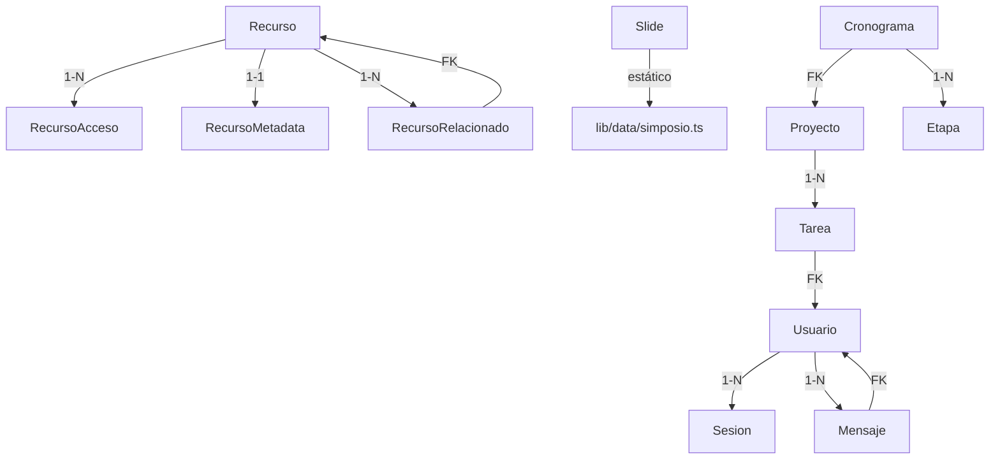

# REGISTRO DE ENTIDADES — NOMON

**Estado:** PROMOVIDO 2026-08-08 (Contrato vivo del schema).
**Regla de supremacía:** Si este documento difiere de cualquier otra fuente (`schema.ts`, `docs/design/`, planes F0–F9), **gana este**. Toda decisión de naming aquí declarada es canónica.

**Fuentes consolidadas:**
- `docs/design/04-auth.md` (Usuario, Sesión, Roles).
- `docs/design/03-recursos.md` (Recurso, Acceso).
- `docs/design/05-correo-aliados.md` (Mensaje, Bandeja).
- `docs/design/02-simposio.md` (Slide).
- `docs/09-auditoria-completa-stack.md` (Stack técnico).

---

## 0. Precedencia de fuentes (regla declarada)

```
REGISTRO_DE_ENTIDADES.md (este documento) > docs/design/* > schema.ts (Drizzle)
```

---

## 1. Auth y Usuarios

**Schema canónico para autenticación y gestión de usuarios.**

| Schema | Nombre natural | Función en el sistema | Relaciones |
|--------|---------------|----------------------|------------|
| `Usuario` | Aliado / Administrador | Autenticación (email + password). Roles: `ALIADO`, `ADMIN`. **Nunca se expone `password_hash` al cliente.** | 1—N `Sesion`, 1—N `Mensaje` (como remitente/destinatario) |
| `Sesion` | Sesión activa | Token (JWT o tabla de sesiones), fecha de expiración, `user_id`. | FK→`Usuario` |

**Notas:**
- **Seguridad:** `password_hash` se hashea con **scrypt** (better-auth) o **bcrypt**, **nunca SHA-256 sin sal** (lección del repo viejo, ver `docs/design/04-auth.md` §⚠️).
- **Validación:** Verificación de contraseña **siempre en el backend** (nunca en el cliente).
- **Deprecado:** El repo viejo usaba `SHA-256(password)` en el navegador + comparación en el cliente. **NO migrar así.**

---

## 2. Recursos / Repositorio

**Schema canónico para la biblioteca de recursos.**

| Schema | Nombre natural | Función en el sistema | Relaciones |
|--------|---------------|----------------------|------------|
| `Recurso` | Documento / Material | Biblioteca de recursos. Campos: `slug`, `titulo`, `imagen`, `metadata`, `pdf_url`, `contenido`. | 1—N `RecursoAcceso`, 1—N `RecursoRelacionado` |
| `RecursoAcceso` | Lista blanca | Emails autorizados para recursos con `acceso = LISTA_BLANCA`. | FK→`Recurso` |
| `RecursoMetadata` | Metadatos | Autor, editorial, año, DOI/ISBN, licencia, idioma, curador, razón NOMON. | FK→`Recurso` |
| `RecursoRelacionado` | Recursos relacionados | Relación entre recursos (`recurso_id` → `relacionado_id`). | FK→`Recurso` (x2) |

**Estrategias de acceso (campo `acceso.estrategia` en `Recurso`):**
| Estrategia | Descripción | Implementación |
|------------|-------------|----------------|
| `PUBLICO` | Cualquiera puede ver el recurso. | Sin validación. |
| `SOLO_REGISTRADOS` | Solo usuarios con sesión activa. | Middleware de Next.js (`/app/middleware.ts`). |
| `LISTA_BLANCA` | Solo usuarios cuyo email está en `RecursoAcceso`. | Validación en API route (`/app/api/recursos/[slug]/route.ts`). |

**Almacenamiento:**
- `pdf_url`: URL en Cloudflare R2 (formato: `https://<account>.r2.cloudflarestorage.com/<bucket>/<key>`).
- `imagen`: URL en Cloudflare R2 o path local (`/public/`).

---

## 3. Simposio

**Schema canónico para el Simposio Internacional de Ética.**

| Schema | Nombre natural | Función en el sistema | Relaciones |
|--------|---------------|----------------------|------------|
| `Slide` | Diapositiva | Contenido del Simposio. Campos: `id`, `title`, `subtitle`, `content`, `readMoreTitle`, `readMoreContent`, `bullets`, `nodes`, `badges`, `gallery`, `accent`. | — |

**Notas:**
- **Origen:** Contenido real de `InteractiveDeck.jsx` / `local_database.json` del repo viejo.
- **Estructura:** 12 slides (portada, marco teórico, justificación, objetivos, sectores, metodología, hub de profesionales, galería).
- **Decisión de diseño:** El deck puede ser **estático** (hardcodeado) o **editable** (con backend). **Pregunta abierta:** ¿Se necesita editar el deck sin re-deploy? (Ver `docs/design/02-simposio.md` §45).
- **Si es estático:** Datos en `lib/data/simposio.ts` (TypeScript).
- **Si es editable:** Tabla `Slide` en Postgres + API routes para CRUD.

---

## 4. Correo Corporativo

**Schema canónico para la bandeja de correo.**

| Schema | Nombre natural | Función en el sistema | Relaciones |
|--------|---------------|----------------------|------------|
| `Mensaje` | Correo | Bandeja única (`contacto@rednomon.com`). Campos: `id`, `direccion` (`ENVIADO`/`RECIBIDO`), `de`, `para`, `asunto`, `cuerpo`, `fecha`, `aliado_ref`. | FK→`Usuario` (remitente/destinatario, nullable) |

**Notas:**
- **Un solo buzón:** No hay un correo por usuario. El buzón es corporativo y lo administra un `ADMIN`.
- **Envío:** Resend API (variable de entorno: `RESEND_API_KEY`).
- **Recepción:** Cloudflare Email Routing → Gmail (a futuro: webhook a Vercel).
- **Almacenamiento:** Histórico de mensajes en Postgres (tabla `Mensaje`).
- **Adjuntos:** Archivos en Cloudflare R2 (campo `adjuntos` en `Mensaje`: array de URLs).

---

## 5. OS Interno (Futuro)

**Schema canónico para el OS interno (cronogramas, tareas, dashboards).**

| Schema | Nombre natural | Función en el sistema | Relaciones |
|--------|---------------|----------------------|------------|
| `Tarea` | Tarea de equipo | Título, descripción, estado (`pendiente`/`en_progreso`/`completada`/`cancelada`), fecha límite, `usuario_asignado_id`. | FK→`Usuario` (asignado) |
| `Proyecto` | Proyecto interno | Nombre, descripción, estado, fecha inicio/fin. | 1—N `Tarea`, 1—N `Cronograma` |
| `Cronograma` | Cronograma | Nombre, descripción, `proyecto_id`. | FK→`Proyecto`, 1—N `Etapa` |
| `Etapa` | Etapa del cronograma | Nombre, fecha inicio/fin, `cronograma_id`. | FK→`Cronograma` |

**Notas:**
- **Estado:** No implementado aún. Prioridad: **Media** (futuro).
- **Relación con web público:** El OS interno vivirá en `/admin` o subdominio (ej: `os.rednomon.com`).
- **Autenticación:** Middleware de Next.js (`/app/middleware.ts`) + better-auth.

---

## 6. Reglas de integridad (axiomas)

1. **Un solo dueño por dato:** Cada campo tiene exactamente una tabla donde nace. No hay duplicación de verdad entre tablas.
2. **FKs de identidad apuntan a `Usuario`:** `Usuario` es la identidad de negocio (login + datos).
3. **Clase ↔ instancia:** El catálogo define lo posible (ej: `RecursoMetadata`); el recurso elige (ej: `Recurso`). No se duplica ficha técnica en el recurso.
4. **Append-only en auditoría:** Las tablas de auditoría (ej: `eventos`, `historial`) nunca reciben UPDATE/DELETE de aplicación.
5. **Gates por recurso, no por proyecto:** El acceso a un recurso se valida individualmente (no por proyecto o usuario).

---

## 7. Tablas deprecadas o absorbidas

| Schema anterior | Destino | Razón |
|----------------|---------|-------|
| `audit_logs` (repo viejo) | No existe | Reemplazado por middleware de Next.js + better-auth. |
| `password_hash` (SHA-256) | `Usuario.password_hash` (scrypt/bcrypt) | Lección de seguridad (ver `docs/design/04-auth.md`). |

---

## 8. Diagrama de Relaciones (Mermaid)


