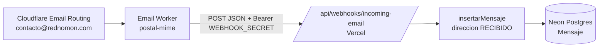

# Auditoría de recepción del correo corporativo

Fecha: 2026-08-10 (auditoría) | 2026-08-11 (verificación end-to-end)

## Resultado ejecutivo

**Verificado el 2026-08-11**: el flujo completo `Cloudflare Email Routing → Worker → /api/webhooks/incoming-email → Neon` funciona. Smoke test con `Authorization: Bearer` válido retornó `200 {"success":true}` y la fila quedó en la tabla `Mensaje` con `direccion: RECIBIDO`, `de: smoke@test.com`, `para: contacto@rednomon.com`.

Diagnóstico de infraestructura (todo verificado OK):
- Worker `rednomon-email-handler` desplegado con bundle de `postal-mime` (109 KiB / 26 KiB gzip).
- 3 secrets configurados en el Worker: `R2_PUBLIC_URL`, `WEBHOOK_SECRET`, `WEBHOOK_URL`.
- Binding R2 `EMAIL_BUCKET` → bucket `rednomon-email-assets` resuelto.
- Email Routing habilitado en `rednomon.com`. Regla activa: `to:contacto@rednomon.com → worker:rednomon-email-handler`.
- DNS MX apunta a Cloudflare (`route1/2/3.mx.cloudflare.net`).
- Endpoint `/api/webhooks/incoming-email` responde `401 {"error":"No autorizado"}` sin Bearer (validación de secret operativa).

Si un correo real no aparece en `/mail`, revisar `wrangler tail rednomon-email-handler` para confirmar que el Worker se invocó y que `fetch(env.WEBHOOK_URL, ...)` retornó `ok`. El Worker no inspecciona `response.ok` actualmente (ver punto 9 de la sección "Puntos de falla posibles").

El contrato entre el Email Worker y el endpoint es coherente: el Worker convierte el mensaje MIME a JSON y envía `Authorization: Bearer <WEBHOOK_SECRET>`; el endpoint exige exactamente ese header, valida `from` y `to`, deduplica por `messageId` y llama a `insertarMensaje` con `direccion: "RECIBIDO"`. El endpoint no acepta ni espera `multipart/form-data`.

`insertarMensaje` ahora genera un UUID como `messageId` de respaldo cuando el proveedor no entrega uno.

## Flujo



## Contrato Worker → endpoint

### Request esperado

- Método: `POST`.
- URL de producción: `https://rednomon.com/api/webhooks/incoming-email`.
- Headers:
  - `Content-Type: application/json`.
  - `Authorization: Bearer <WEBHOOK_SECRET>`; la comparación es exacta.
- JSON:

```json
{
  "messageId": "<message-id del correo>",
  "from": "remitente@dominio.com",
  "to": "contacto@rednomon.com",
  "subject": "Asunto",
  "bodyText": "Texto plano",
  "bodyHtml": "<p>HTML opcional</p>"
}
```

El Worker también envía `direction` y `attachments`, pero el endpoint actual los ignora. No envía multipart: `postal-mime` procesa `message.raw` dentro del Worker y el resultado viaja como JSON.

### Validaciones y respuestas

| Condición | Respuesta |
|---|---|
| `WEBHOOK_SECRET` ausente en Vercel | `500 {"error":"WEBHOOK_SECRET no configurado"}` |
| Bearer ausente o diferente | `401 {"error":"No autorizado"}` |
| Body no es JSON válido | `400 {"error":"JSON inválido"}` |
| Falta `from` o `to` | `400 {"error":"from y to son requeridos"}` |
| `messageId` ya existe | `200 {"success":true,"deduplicado":true}` |
| Inserción correcta | `200 {"success":true}` |
| Error de Neon/Drizzle | `500` generado por la función; el endpoint no captura ese error |

### Persistencia

`app/src/app/api/webhooks/incoming-email/route.ts` fija `direccion: "RECIBIDO"`, copia `from` a `de`, copia `to` a `para` y usa `(Sin asunto)` o texto vacío cuando faltan asunto o cuerpo. Con la regla dirigida a `contacto@rednomon.com`, `message.to` debe ser ese buzón. `app/src/lib/mail.ts` inserta esos valores, marca `enviado: false` para recibidos y mantiene la restricción única de `Mensaje.message_id`; si no llega un ID del proveedor, genera un UUID de respaldo.

## Puntos de falla posibles

1. **DNS:** los MX de `rednomon.com` no apuntan a Cloudflare Email Routing o la zona no aparece como verificada.
2. **Regla de routing:** `contacto@rednomon.com` no tiene una regla activa con acción *Send to a Worker*, o apunta a otro Worker.
3. **Deploy del Worker:** `index.js` se pegó en el dashboard sin bundle y el import de `postal-mime` falla. Debe desplegarse con Wrangler.
4. **Binding R2:** si el correo trae adjuntos y `EMAIL_BUCKET` no está enlazado o el bucket no existe, el Worker falla antes del POST.
5. **Variables del Worker:** faltan `WEBHOOK_URL` o `WEBHOOK_SECRET`, o `WEBHOOK_URL` no es la ruta de producción.
6. **Secret distinto:** el valor del Worker no coincide exactamente con `WEBHOOK_SECRET` del entorno Production de Vercel.
7. **Endpoint no alcanzable:** error DNS/TLS, timeout, alias de Vercel incorrecto o despliegue que no contiene la ruta.
8. **Formato:** un emisor externo entrega MIME inválido y `postal-mime` lanza antes de construir el JSON. `multipart/form-data` no interviene en este diseño.
9. **Respuesta no comprobada por el Worker:** el Worker espera que `fetch` termine, pero no inspecciona `response.ok`; un `401`, `400` o `500` puede quedar sin señal útil si no se observa `wrangler tail`.
10. **Base de datos:** `DATABASE_URL` ausente/incorrecta en Vercel, Neon suspendido, error de conexión o restricción única en una carrera de deduplicación.

## Diagnóstico en Cloudflare

Ejecutar desde la raíz del repo. Estos comandos no muestran los valores de los secretos:

```powershell
npx wrangler whoami
npx wrangler deployments list --name rednomon-email-handler
npx wrangler secret list --name rednomon-email-handler
npx wrangler tail rednomon-email-handler --format pretty
```

Mantener `wrangler tail` abierto y enviar un correo real a `contacto@rednomon.com`. En otra terminal, comprobar DNS:

```powershell
Resolve-DnsName rednomon.com -Type MX
Resolve-DnsName rednomon.com -Type TXT
```

La lista de secretos debe contener `WEBHOOK_SECRET`; `WEBHOOK_URL` puede estar como variable no secreta en Settings → Variables. La regla se verifica en Cloudflare → Email → Email Routing → Routing rules: dirección `contacto@rednomon.com`, acción *Send to a Worker*, destino `rednomon-email-handler`, estado activo.

Para confirmar que Wrangler puede resolver y empaquetar `postal-mime` sin publicar:

```powershell
npx wrangler deploy --config workers/email-handler/wrangler.toml --dry-run --outdir .wrangler-dry-run
```

El directorio temporal generado por ese comando no se debe commitear.

## Diagnóstico en Vercel

Desde un checkout vinculado al proyecto de Vercel:

```powershell
npx vercel whoami
npx vercel env ls production
npx vercel logs rednomon.com --since 1h --follow
```

La lista de variables de Production debe incluir al menos `WEBHOOK_SECRET` y `DATABASE_URL`. Para probar solo alcance y configuración del secret, sin insertar una fila, ejecutar sin autorización:

```powershell
curl.exe -i -X POST "https://rednomon.com/api/webhooks/incoming-email" `
  -H "Content-Type: application/json" `
  --data-raw '{"from":"diagnostico@example.com","to":"contacto@rednomon.com"}'
```

Resultado esperado: `401` si `WEBHOOK_SECRET` está configurado. Un `500` con `WEBHOOK_SECRET no configurado` identifica la variable ausente. No usar un Bearer válido en esta prueba, porque un request autorizado insertaría el mensaje en producción.

## Logs esperados en Vercel

La ruta no contiene `console.log` ni `console.info` para una recepción correcta. Por tanto, con un correo real válido se espera una invocación de `POST /api/webhooks/incoming-email` con estado `200`, pero no una línea de aplicación con remitente, asunto o `messageId`.

Al diagnosticar, correlacionar la hora del correo con:

- `200`: insertado, o deduplicado si el mismo `messageId` ya existía.
- `400`: JSON inválido o faltan `from`/`to`; revisar el payload del Worker.
- `401`: `WEBHOOK_SECRET` no coincide.
- `500`: secret o `DATABASE_URL` ausente, error de Neon/Drizzle u otra excepción del runtime.
- Ninguna invocación: el fallo está antes de Vercel, normalmente DNS, Email Routing, ejecución/bundle del Worker o `WEBHOOK_URL`.

En `wrangler tail`, una excepción de `postal-mime`, R2 o red antes del `fetch` confirma que el endpoint nunca fue invocado. El Worker actual no registra explícitamente el status del webhook, por lo que Vercel es la fuente para distinguir `200`, `401`, `400` y `500`.
